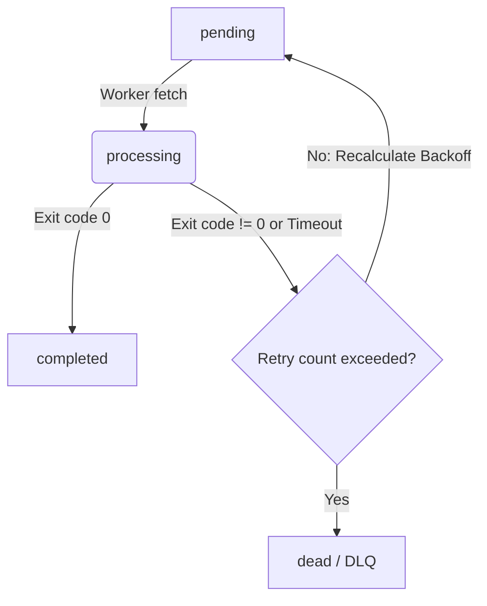

# QueueCTL - CLI-Based Background Job Queue System

**QueueCTL** (`queuectl`) is a production-grade, lightweight, and minimal Command Line Interface (CLI) background job queue system built in Python. It manages background processes, executes shell commands, handles retries with exponential backoff, prevents duplicate execution via robust database locking, and routes permanently failed jobs to a Dead Letter Queue (DLQ).

---

## Features

-   ✅ **Persistent Job Storage**: Data is kept safe across system restarts using SQLite in Write-Ahead Logging (WAL) mode.
-   ✅ **Parallel Worker Execution**: Supports spawning multiple independent worker processes that run in parallel.
-   ✅ **Concurrency Safety (Locking)**: Uses SQLite's atomic write-ahead locking (`BEGIN IMMEDIATE`) to guarantee no job is picked up by multiple workers simultaneously.
-   ✅ **Graceful Shutdown**: Workers finish executing their active job before terminating.
-   ✅ **Exponential Backoff Retries**: Automatically retries failed jobs with configurable exponential backoff delays.
-   ✅ **Dead Letter Queue (DLQ)**: Moves permanently failed jobs to the DLQ after exhausting their retries.
-   ✅ **Configurable Settings**: Allow configuring retry limit, backoff base, and default job timeout globally or on a per-job basis.
-   
-   🌟 **Bonus Features Implemented**:
    -   **Job Timeout Handling**: Automatically kills jobs exceeding their timeout limits (robustly handled on Windows and Unix).
    -   **Job Priority Queues**: Prioritizes jobs (Low/Normal/High) so high-priority tasks run first.
    -   **Scheduled & Delayed Jobs**: Run jobs at a specific time (`run_at`) or after a relative duration (`delay`).
    -   **Detailed Execution Logging**: Individual stdout/stderr logs for every execution are recorded under `.queuectl/logs/<job_id>.log`.

---

## 1. Setup & Installation

### Prerequisites
-   Python 3.7 or newer.
-   Standard Python library is used; there are **zero external dependencies** required to run the CLI or workers.

### Installation Steps

1.  Clone the repository:
    ```bash
    git clone https://github.com/vidhan-tiwari/QueueCTL.git
    cd QueueCTL
    ```

2.  Install the package in editable mode to register the `queuectl` CLI executable:
    ```bash
    pip install -e .
    ```
    *Note: If `pip` is not globally available on Windows, run `python -m pip install -e .` instead.*

3.  Verify installation:
    ```bash
    queuectl --help
    ```

---

## 2. Usage Examples & CLI Commands

All state, logs, and configurations are stored in the local `.queuectl/` folder inside the workspace.

### Enqueuing Jobs (`queuectl enqueue`)
Enqueues a job from a JSON payload. The payload must contain an `id` and a `command`.

```bash
# Basic Job
queuectl enqueue "{\"id\": \"job-1\", \"command\": \"echo Hello World\"}"

# Job with Priority (0: Low, 1: Normal, 2: High), Max Retries, and Timeout (seconds)
queuectl enqueue "{\"id\": \"job-2\", \"command\": \"sleep 3\", \"priority\": 2, \"max_retries\": 5, \"timeout\": 5}"

# Delayed Job (run in 10 seconds)
queuectl enqueue "{\"id\": \"job-3\", \"command\": \"echo Delayed\", \"delay\": 10}"

# Scheduled Job (run at specific ISO timestamp)
queuectl enqueue "{\"id\": \"job-4\", \"command\": \"echo Scheduled\", \"run_at\": \"2026-07-18T12:00:00Z\"}"
```
*Expected Output:*
```text
Successfully enqueued job 'job-1'.
```

### Worker Management (`queuectl worker`)

#### Start Workers
Spawns background worker processes.
```bash
queuectl worker start --count 3
```
*Expected Output:*
```text
Successfully started 3 background worker(s).
```

#### Stop Workers Gracefully
Signals all active workers to shut down. The CLI waits for workers to finish their active jobs before confirming shutdown.
```bash
queuectl worker stop
```
*Expected Output:*
```text
Signaled 3 worker(s) to shut down gracefully...
Waiting for 2 worker(s) to finish current jobs...
All workers stopped successfully.
Successfully stopped workers (gracefully shut down 3 processes).
```

### Monitoring Queue Status (`queuectl status`)
Shows a summary of all job states and active worker processes.
```bash
queuectl status
```
*Expected Output:*
```text
==================== QueueCTL Status ====================
Database Path:  C:\Users\PC\Desktop\QueueCTL\.queuectl\queuectl.db

Job Status Summary:
  Pending:    1
  Processing: 0
  Completed:  3
  Failed:     0 (retryable)
  Dead (DLQ): 1

Active Workers (2):
  - Worker ID: e68a6f2b... | PID: 12344 | State: running | Heartbeat: Just now
  - Worker ID: fa2f8c51... | PID: 12345 | State: running | Heartbeat: 12s ago
=========================================================
```

### Web Monitoring Dashboard (`queuectl dashboard`)
Runs a built-in lightweight HTTP server to monitor job queues and active workers in real-time via a clean web interface (auto-refreshes every 3 seconds).
```bash
queuectl dashboard --port 8000
```
*Expected Output:*
```text
=====================================================
QueueCTL Monitor Dashboard active!
URL: http://localhost:8000/
Press Ctrl+C to stop the dashboard server.
=====================================================
```
Open `http://localhost:8000/` in your browser to view the real-time dark-mode dashboard!

### Listing Jobs (`queuectl list`)
Lists jobs and their details, optionally filtered by state.
```bash
queuectl list --state pending
```
*Expected Output:*
```text
ID              State        Priority Attempts   Max Retries  Next Run At               Command
----------------------------------------------------------------------------------------------------
job-3           pending      1        0          3            2026-07-18T10:35:10+00:00 echo Delayed
```

### Dead Letter Queue (`queuectl dlq`)

#### List Dead Jobs
```bash
queuectl dlq list
```
*Expected Output:*
```text
ID              Priority Attempts   Failed At                 Error Log
----------------------------------------------------------------------------------------------------
job-failing     1        4          2026-07-18T10:34:55+00:00 Command failed with exit code 1.
```

#### Retry/Reschedule Dead Jobs
Moves a job out of the DLQ back to a `pending` state for immediate execution.
```bash
queuectl dlq retry job-failing
```
*Expected Output:*
```text
Successfully rescheduled job 'job-failing' from DLQ for immediate execution.
```

### Global Configuration (`queuectl config`)
Manages configuration parameters persistent in the DB.
```bash
# View configuration
queuectl config

# Modify configuration
queuectl config set max-retries 4
queuectl config set backoff-base 1.5
queuectl config set default-timeout 120
```

---

## 3. Architecture Overview

### Data Persistence (SQLite)
The application state is maintained in a SQLite database (`.queuectl/queuectl.db`). 
*   **Write-Ahead Logging (WAL)**: Enabled on startup to allow concurrent read connections while a write transaction is ongoing.
*   **Heartbeat system**: Active workers update their heartbeat timestamp in the database every 1 second. Dead workers can be pruned by comparing their last heartbeat to the current time.

### Concurrency & Job Locking
To guarantee that a job is **never** executed by multiple workers simultaneously, the worker uses manual SQL transaction locking:
1.  Disables autocommit (`isolation_level = None`).
2.  Starts a write-exclusive transaction using `BEGIN IMMEDIATE`.
3.  Queries the oldest pending job that is eligible for run (`next_run_at <= NOW()`), ordering by priority.
4.  Updates that job's state to `processing` and associates it with the worker's unique ID.
5.  Commits the transaction.
If another worker attempts to retrieve a job at the same time, SQLite blocks or raises an `OperationalError` (busy) on one of the transactions, which is caught and handled by retrying on the next polling cycle.

### Job Lifecycle States


### Worker Process Management
-   On Windows, background workers are spawned in a detached process group to decouple them from the main CLI process.
-   On Unix, they are spawned as background child processes.
-   **Graceful Shutdown**: The worker's signal handlers capture `SIGINT` and `SIGTERM`. If received, the worker finishes processing the current job, deletes its registration row, and exits safely. Alternatively, updating the worker state to `shutting_down` in the database will cause the worker to terminate gracefully on its next loop iteration.

---

## 4. Assumptions & Trade-offs

-   **SQLite Database Location**: Stored in a `.queuectl/` folder relative to the script package. This ensures that the CLI always interacts with a single persistent queue database within the workspace directory, rather than separate ones per subfolder.
-   **Subprocess Shell Execution**: Python's `subprocess.Popen` is run with `shell=True` to support standard Windows and Unix shell built-ins (like `echo` or `dir`).
-   **Windows Process Group Terminations**: To implement timeouts on Windows when running shell commands (`shell=True`), killing the process using standard `Popen.kill()` only terminates the shell wrapper, leaving child processes hanging. We resolved this by using Windows' native `taskkill /F /T` process tree termination utility to prevent orphaned process leaks.

---

## 5. Testing & Verification

The project includes a comprehensive test suite written with the built-in `unittest` framework.

### Running Automated Tests
Run the test suite using standard Python:
```bash
python -m unittest tests/test_queuectl.py
```
*Expected Output:*
```text
Ran 7 tests in 5.578s

OK
```

The tests validate:
1.  **Configuration**: Persistent get and set operations.
2.  **Enqueueing**: Creation and default fields parsing.
3.  **Concurrency Locking**: Multiple workers fetching jobs without duplicates or overlaps.
4.  **Success Flow**: Completed state transitions.
5.  **Failure Flow**: Exponential backoff scheduling and DLQ transition.
6.  **Timeouts**: Safe process tree termination when job execution exceeds limits.
7.  **Background Spawning**: Process manager starts workers, registers heartbeats, and stops them gracefully.
